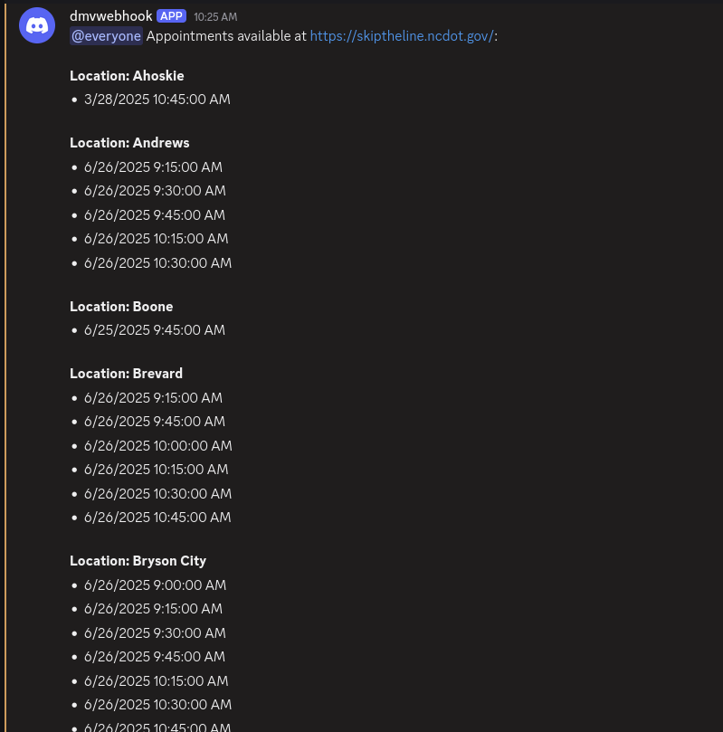

NC-DMV-Scraper is a tool you can use to become aware of DMV appointments right when they become available, without all the extra work of constantly manually monitoring the DMV website.



It uses selenium to scrape appointment locations, dates, and times, from https://skiptheline.ncdot.gov/.

I strongly recommend you set it up yourself, but if you are entirely unwilling to do that ( even though it is quite easy ), you could reach out to me ( tommy092464_62746 on discord, or via github issues ) and pay me like 5 bucks and ill host it for you for however long you need, with absolutely no uptime guarantees ( e.g. if my power, or internet go out, that sucks for you. ). 

# Setup

In order to set it up, you must first install Firefox, python, selenium, and the selenium geckodriver

https://www.mozilla.org/en-US/firefox/new/

https://www.python.org/downloads/

https://github.com/mozilla/geckodriver/releases

then, you must install the dependencies

open a terminal and run

```bash
pip3 install requests geopy selenium
```

if that does not work, try

```bash
python -m pip install requests geopy selenium
```

or you can try installing the included requirements.txt by using above `pip3` or `python`, or with below `python3` binary:

```bash
python3 -m pip install -r requirements.txt
```

Then, download the code for this by clicking the green code button in the top right, and clicking download zip. Open that zip up, and extract it somewhere.

Then, you need to get the file path for the geckodriver you downloaded, open up scrapedmv.py in a texteditor, and replace the line that says this:

```python
GECKODRIVER_PATH = os.getenv('GECKODRIVER_PATH','YOUR_GECKODRIVER_PATH_HERE') # Replace with your geckodriver path
```

with your geckodriver path, like this:

```python
GECKODRIVER_PATH = '/home/tommy/.cache/selenium/geckodriver/linux64/0.35.0/geckodriver' # Replace with your geckodriver path
```

Your format will depend on your operating system, e.g. on windows it may be like `GECKODRIVER_PATH = 'C:/Users/tommy/Downloads/0.35.0/geckodriver.exe'` or something like that. 


Then, you need to go to discord, and create a webhook in a server you own ( make a server if you dont have one )
You can do that by going to the server, right clicking a channel -> edit channel -> integrations -> webhooks -> new webhook -> copy webhook url

Then open up scrapedmv.py in a text editor, and replace the line that says this:
```python
YOUR_DISCORD_WEBHOOK_URL = os.getenv("YOUR_DISCORD_WEBHOOK_URL", "YOUR_WEBHOOK_URL_HERE") # !!! REPLACE WITH YOUR ACTUAL WEBHOOK URL !!!
```

with your webhook url, like this:

```python
YOUR_DISCORD_WEBHOOK_URL = "https://discord.com/api/webhooks/10920931091/-JAOIFJWjenirieojOAJOIWjonfrreywoijojwojoOIAJODAab3" # !!! REPLACE WITH YOUR ACTUAL WEBHOOK URL !!!
```

( that is not a real webhook url to be clear ) 

Then, you just run `python3 scrapedmv.py`, and every 5 minutes or so it will start the scraping process. That is all you have to do to get it up and running!

# Appointment type
You can choose the type of appointment by editing scrapedmv.py on the line where it says 

```python
APPOINTMENT_TYPE = os.getenv("APPOINTMENT_TYPE", "Driver License - First Time")
```

you can change that to
```python
APPOINTMENT_TYPE = "Fees"
```

or

```python
APPOINTMENT_TYPE = "Non-CDL Road Test"
```

or any of the other button names on the appointment choosing section of the website, just make sure you get the exact name  from skiptheline.ncdot.gov. e.g. if you were to say

```python
APPOINTMENT_TYPE = "Non CDL Road Test"
```

That would fail, because it would only find the one with the -, and that would not match.

You can also change this with docker by setting environment variables

```bash
docker run -e YOUR_DISCORD_WEBHOOK_URL="PUT_YOUR_WEBHOOK_URL_HERE" -e APPOINTMENT_TYPE="Teen Driver Level 1" ghcr.io/tmcelroy2202/nc-dmv-scraper:latest
```


# Filtering
There is also appointment filtering you can apply in that file:

You can set an address, and a distance range, and have it only look for dmv locations within that range of miles from the given address

You would do that by changing these values

```python
YOUR_ADDRESS = os.getenv("YOUR_ADDRESS")
DISTANCE_RANGE_MILES_STR = os.getenv("DISTANCE_RANGE")
```

so that they looked like this:

```python
YOUR_ADDRESS = "1337 Testing Lane, Charlotte NC"
DISTANCE_RANGE_MILES_STR = "40"
```

You can also set specific time and date ranges to scan for, by changing these lines:

```python
DATE_RANGE_START_STR = os.getenv("DATE_RANGE_START")
DATE_RANGE_END_STR = os.getenv("DATE_RANGE_END")
DATE_RANGE_RELATIVE_STR = os.getenv("DATE_RANGE")
TIME_RANGE_START_STR = os.getenv("TIME_RANGE_START")
TIME_RANGE_END_STR = os.getenv("TIME_RANGE_END")
```

examples of things you could do with them are:

```python
DATE_RANGE_START_STR = "01/23/2025"
DATE_RANGE_END_STR = "09/23/2025"
```

to only show appointments from 01/23/2025 to 09/23/2025.

or

```python
DATE_RANGE_RELATIVE_STR = "2w"
```

to only show appointments in the next 2 weeks ( could also do 1m for one month, or 5d for 5 days, etc. ) 

or

```python
TIME_RANGE_START_STR = "3:00"
TIME_RANGE_END_STR = "19:00"
```

to only show appointments from 3:00AM to 7:00PM.

#### If you wish to run via Docker, you can do that as well:

Run a pre-built image
```bash
docker run -e YOUR_DISCORD_WEBHOOK_URL="PUT_YOUR_WEBHOOK_URL_HERE" ghcr.io/tmcelroy2202/nc-dmv-scraper:latest
```

To run via docker with custom filtering arguments, you would do, for example:

```bash
docker run -e YOUR_DISCORD_WEBHOOK_URL="PUT_YOUR_WEBHOOK_URL_HERE" -e YOUR_ADDRESS="1337 Testing Lane, Charlotte NC" -e DISTANCE_RANGE=50 -e DATE_RANGE_START="03/23/2025" -e DATE_RANGE_END="09/23/2025" -e TIME_RANGE_START="8:00" -e TIME_RANGE_END="9:00" ghcr.io/tmcelroy2202/nc-dmv-scraper:latest
```

or, if you wish to build the docker container locally:

Docker build

```bash
docker build -t nc-dmv-scraper -f Dockerfile
```

then

Run Container (this time, using `podman`)
```bash
podman run \
-e YOUR_DISCORD_WEBHOOK_URL="https://discord.com/api/webhooks/1364-EXAMPLE_WEBHOOK_URLMSU3" \
-e APPOINTMENT_TYPE="ID Card" \
-e "YOUR_ADDRESS=101 E Davie St, Raleigh NC" \
-e "DISTANCE_RANGE=100" \
-e "DATE_RANGE=4w" \
-e "MSG_MENTION=Yo, "\
nc-dmv-scraper:latest
```

# Docker Compose
If you wish to run via docker compose, you can just git clone this repository, set your webhook URL in docker-compose.yml, then run
```bash
docker compose up -d
```

If you wish to customize the environment variables, they can be edited in docker-compose.yml like this:

```yaml
services:
  dmv-scraper:
    image: ghcr.io/tmcelroy2202/nc-dmv-scraper:latest
    container_name: nc-dmv-scraper
    environment:
      # --- IMPORTANT: Update this ---
      YOUR_DISCORD_WEBHOOK_URL: "YOUR_WEBHOOK_URL_HERE"

      # --- Extra Configuration ---
      APPOINTMENT_TYPE: "Driver License - First Time"
      YOUR_ADDRESS: "1337 Testing Lane, Charlotte NC"
      DISTANCE_RANGE: 50
      DATE_RANGE_START: "03/23/2025"
      DATE_RANGE_END: "09/23/2025"
      # do not use date_range relative ( e.g. 2w ) AND date_range_start / date_range_end at same time. use one or the other.
      DATE_RANGE: "2w"
      # TIME_RANGE_START: "8:00"
      # TIME_RANGE_END: "19:00"
    restart: unless-stopped
```
